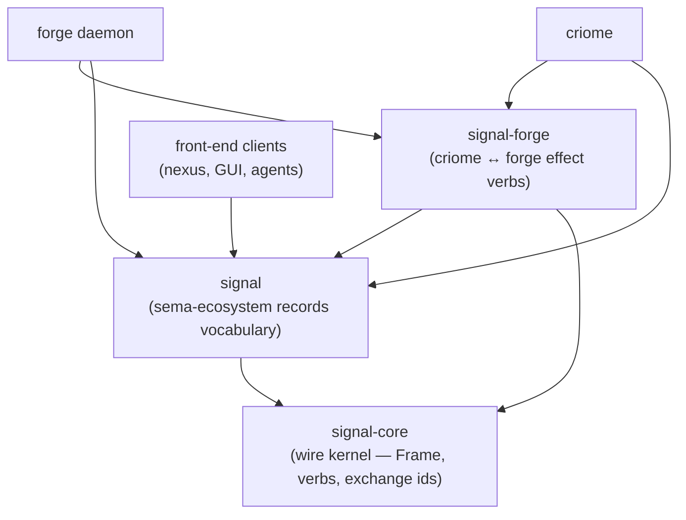

# signal-forge — architecture

*Layered Signal contract for the criome ↔ forge leg. Carries
effect-bearing requests that criome dispatches to forge for
execution — typed payloads only; criome itself runs nothing.*

## 0 · TL;DR

`signal-forge` is a **layered effect crate** atop `signal-core` and
`signal`. It re-uses `signal-core`'s `Frame` envelope, handshake,
`SignalVerb` six-root spine, and exchange-identifier mechanics, and
adds the per-verb typed payloads on the narrow criome ↔ forge wire.

## MUST IMPLEMENT — signal architecture migration

This contract is migrating to contract-local verbs per
`primary/reports/designer/238-signal-architecture-redirection-contract-local-verbs.md`
and `primary/reports/designer/239-signal-architecture-migration-plan.md`.

The current shape is two `Mutate`-tagged variants (`Build`, `Deploy`)
plus a deferred `StoreEntry*` family. Drop the `Mutate` prefix —
`Build` and `Deploy` are already verb-form contract-local roots; they
read correctly as "criome is asking forge to build this" / "criome is
asking forge to deploy this." Payloads stay as the typed nouns
(`BuildRequest` becomes `Build`'s payload, perhaps renamed to a
plain noun like `Target`). The `StoreEntry*` family that's still
TBD likely splits to `signal-arca` per the existing note in §2;
when it does, use contract-local verbs there too (`Get`, `Put`,
`Materialize`, `Delete` — all already verb-form). The dependency on
`signal-core` shifts to `signal-frame`; `Frame` envelope and
handshake stay the same (frame mechanics only).

References: `primary/reports/designer/238-signal-architecture-redirection-contract-local-verbs.md`,
`primary/reports/designer/239-signal-architecture-migration-plan.md`.

**Note to remover:** when the refactor lands, remove this section and
add a `## Migration history — contract-local verbs (2026-05-XX)`
paragraph noting the shape change.

Front-end clients (nexus, GUI editor, agents, mentci-lib) depend on
`signal` for the sema-ecosystem vocabulary; they do **not** depend
on `signal-forge`. Builder-internal churn in this crate recompiles
only criome + forge, not the wider workspace. This is the canonical
example of `~/primary/skills/contract-repo.md` §"The layered
pattern".



> **Status (2026-05-17): skeleton-as-design.** Bodies land when
> forge-daemon is wired. The current `src/lib.rs` is `todo!()`
> placeholders. The discipline below is the shape implementations
> must satisfy.

> **Scope (today vs eventually).** This contract sits on today's
> stack — `signal-core` wire kernel, rkyv archives. The
> eventually-self-hosting stack is Sema-on-Sema; this layered crate
> is a realization step. See `~/primary/ESSENCE.md` §"Today and
> eventually".

## 1 · Channel boundary

| Side | Component |
|---|---|
| Request producer | `criome` (dispatching effect-bearing work it itself does not execute). |
| Request consumer | `forge` daemon. |
| Reply producer | `forge` daemon. |
| Reply consumer | the `criome` request that issued the operation. |

Criome holds typed records (per `criome/ARCHITECTURE.md`); when an
effect needs to be performed (build a binary, deploy a system,
manipulate the arca store), criome dispatches the typed request
over this leg. Criome never invokes `nix`, `nixos-rebuild`, or the
filesystem directly. Forge owns the effect surface.

Transport is `signal-core` length-prefixed rkyv frames over a Unix
socket. The transport itself belongs to forge, not this contract.

## 2 · Request variants and their SignalVerbs

The channel is declared via one `signal_channel!` invocation in
`src/lib.rs` per `signal-core/ARCHITECTURE.md` §3. The macro emits
the typed `ForgeRequest` / `ForgeReply` enums, the per-variant
`ForgeRequest::signal_verb()` witness, the frame alias
(`ExchangeFrame` — this channel has no streams in the v1 design),
and the NOTA codec impls.

Every cross-component Signal request declares its root verb. For
this leg:

| Request variant | Verb | What happens | Authority direction |
|---|---|---|---|
| `Build(BuildRequest)` | `Mutate` | Criome orders forge to build a target. Payload carries the records criome read from sema (target `Graph` + transitive `DependsOn` + `Contains` nodes + edges) plus a criome-signed capability token authorising forge to deposit into the target arca store. Forge links prism, assembles the workdir, invokes nix (crane + fenix), bundles the closure into arca's staging area, and signals arca-daemon. | top-down (criome → forge) — authority order. Criome holds *possibly-mutated* state until forge confirms. |
| `Deploy(DeployRequest)` | `Mutate` | Criome orders forge to perform a `nixos-rebuild` against a target host (system flake + host identity + activation mode). | top-down — authority order. |
| `StoreEntry*` | (TBD) | Get / put / materialize / delete against arca, gated by capability tokens. **Likely migrates to `signal-arca` when that contract crate lands.** Verb assignments deferred to that design pass. | TBD |

`Build` and `Deploy` are `Mutate` per `signal-core/ARCHITECTURE.md`
§1 ("Mutate is the authority verb — *change this; I do not care
what you think*; subordinate obeys and confirms"). Criome is the
authority root for forge on this leg; forge obeys and confirms.

## 3 · Reply variants and reply discipline

Reply payloads:

- `BuildOk { arca_hash, narhash, wall_ms }` — forge confirms the
  build completed; criome then asserts the `CompiledBinary` record
  to sema using `arca_hash` as canonical identity.
- `DeployOk { generation, wall_ms }` — forge confirms activation.
- `Failed { code, message }` — typed failure for either; closed
  reason vocabulary, never an untyped error string.

Replies do **not** need their own `SignalVerb`. They are causally
tied to the request that issued them, and their legality is
checked against that request's operation. Per
`~/primary/skills/contract-repo.md` §"Reply discipline": if a
*"reply"* becomes a standalone observation that can travel
independently (e.g., a build-progress event observed by a
subscriber other than the issuing criome), it lands as a separate
request variant — `Assert` for a new fact, `Subscribe` for a
streaming observation — not as a verb-less message.

## 4 · Capability tokens

The `BuildRequest` payload includes a criome-signed capability
token authorising forge to deposit into a specific arca store
namespace. Forge does not interpret the token semantically beyond
verifying the signature; arca-daemon checks the token against its
own policy when forge submits the closure.

Capability-token shape on this leg is part of this contract; arca's
own capability validation lives in `signal-arca` when that crate
lands.

## 5 · Constraints

- This is a pure contract crate. No actors, no `tokio`, no
  filesystem I/O, no `nix` calls. Behavior lives in `forge`.
- The channel re-uses `signal-core`'s `ExchangeFrame` envelope and
  `ProtocolVersion`/handshake. This crate does **not** redefine
  those types.
- Every `ForgeRequest` variant carries a declared `SignalVerb`; the
  `signal_channel!` macro emits the per-variant witness and the
  receiver rejects frames whose payload-declared verb does not
  match the wire verb (per
  `signal-core/ARCHITECTURE.md` §3 receiver constraint).
- Closed enums only. **No `Unknown` variant.** Lifecycle uncertainty
  is encoded as a positive closed variant (e.g., `Failed::reason`
  carries a closed `BuildFailureReason` enum, not a string kind).
- Bulk byte payloads never cross criome. Effect-bearing payloads
  reference content by `arca_hash`; the bytes themselves travel
  arca↔forge↔target out-of-band.
- Naming follows `~/primary/skills/naming.md`: full English words;
  no crate-name prefix on types.
- rkyv on the wire; NOTA derives on every typed record so the same
  type IS the binary record AND IS the text record.
- Round-trip tests per record kind in `tests/`: rkyv archive
  round-trip AND NOTA text round-trip, both witnessed.
- Domain payload-to-verb mapping lives in this contract crate (in
  the `signal_channel!` declaration), not in forge or criome.

## 6 · Owned / not owned

**Owned:**

- The criome → forge per-verb typed payloads on this layer.
- Capability-token shape for the criome → forge leg (criome-signed
  authorisation to deposit into a target arca store).
- The per-variant `SignalVerb` mapping.
- Round-trip witnesses for every record kind (rkyv + NOTA).

**Not owned (re-used from `signal-core` and `signal`):**

- `Frame` envelope, handshake, `ProtocolVersion` — `signal-core`.
- The `SignalVerb` enum itself — `signal-core`.
- The sema-ecosystem record vocabulary (`Node`, `Edge`, `Graph`,
  `Records`, etc.) — `signal`. `BuildRequest` carries instances of
  those types but does not redefine them.
- Front-end-visible verbs (`Assert`, `Match`, `Validate`,
  `Subscribe`) on sema-ecosystem records — `signal`.

**Not owned (component responsibility):**

- Forge's actor tree, the `nix`/`crane`/`fenix` invocation, the
  workdir-assembly logic, the prism emission templates — forge.
- Arca's store policy, capability-validation rules, replication
  topology — arca / future `signal-arca`.

## 7 · Why layered atop signal-core (not parallel to it)

**Audience-scoped compile-time isolation.** The criome ↔ forge leg
has a narrow audience — criome (sender), forge (receiver),
lojix-cli (transitional sender of deploy verbs). Front-end clients
(nexus daemon, GUI editor, mentci-lib, agents) never need these
verbs and must not depend on them. Splitting the builder protocol
into its own crate means builder-internal field churn (adding
`nix_target_platform`, refining outcomes, evolving capability-token
shapes, growing the store-entry verb family) recompiles only
criome + forge, not the wider workspace.

**Layered, not parallel.** `signal-forge` re-uses the
`signal-core` kernel — `Frame`, handshake, six-root verb spine,
exchange identifiers — and contributes only the per-verb typed
payloads on this leg. A parallel protocol would duplicate
envelope/handshake/verb machinery and force every implementer to
ship two stacks. Layering keeps the wire-protocol invariants (rkyv
encoding, content-addressing of attached records, capability-token
verification) in one place.

## 8 · Code map

```text
src/
└── lib.rs   — signal_channel! declaration + typed payloads.
              Currently todo!() skeleton-as-design.
tests/
└── round_trip.rs  — per-variant rkyv + NOTA round-trips
                     (lands with the bodies).
```

## See also

- `~/primary/skills/contract-repo.md` §"The layered pattern" — the
  canonical discipline this crate exemplifies.
- `~/primary/skills/contract-repo.md` §"Signal is the database
  language" — the six-root verb spine every Signal request
  declares.
- `~/primary/ESSENCE.md` §"Perfect specificity at boundaries" — the
  principle this contract repo encodes across processes.
- `/git/github.com/LiGoldragon/signal-core/ARCHITECTURE.md` — the
  wire kernel this crate layers atop.
- `/git/github.com/LiGoldragon/signal/ARCHITECTURE.md` — the
  sema-ecosystem records vocabulary `BuildRequest` carries.
- `/git/github.com/LiGoldragon/criome/ARCHITECTURE.md` — the
  sender side of this leg.
- `/git/github.com/LiGoldragon/forge/ARCHITECTURE.md` — the
  receiver side; owns the effect surface.
